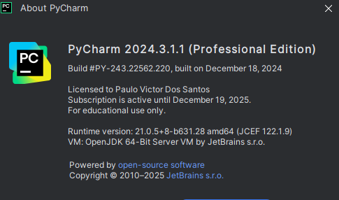
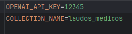

# Chat Laudo - RAG de Laudos Médicos

Aplicação web desenvolvida em **Streamlit** com **Agentes Inteligentes** para análise, processamento e classificação de laudos médicos. Este projeto permite que os usuários façam o upload de documentos PDF de laudos médicos, processem esses arquivos e obtenham informações classificadas, como quantidade de laudos por especialidade, modalidade e o total de laudos processados.

Além de possibilitar que os agentes possam esclarecer de forma resumida e em linguagem de fácil entendimento o conteúdo do laudo médico.

## Principais Funcionalidades

- **Interface amigável** com Streamlit
- **Upload de arquivos PDF** diretamente via interface
- **Processamento de laudos médicos** para extração de informações relevantes
- **Classificação** e contagem de laudos por categorias:
  - Especialidade
  - Modalidade
  - Total de documentos processados
- **Notificações e mensagens de erro** durante o processamento

## Tecnologias Utilizadas

- **Python**: Linguagem principal para desenvolvimento
- **Streamlit**: Framework para criação de aplicações web interativas
- **Qdrant**: Utilizado para consulta e contabilização de classes de laudos médicos
- **Bibliotecas auxiliares**:
  - Manipulação e processamento de arquivos PDF
  - Integração com componentes de I/O no Streamlit

## Estrutura do Projeto

```plaintext
├── data/
│   ├── Protocolo.py         # Classe de modelagem de negócio
├── docs/                    # Dataset de laudos anonimizados e privados
├── src/
│   ├── Util.py              # Classe utilitária para suporte ao processamento de textos e PDFs
│   ├── Enumeradores.py      # Classe de domínio da área médica
│   ├── Agentes.py           # Classe responsável por manter os agentes inteligentes
│   ├── QdrantConection.py   # Integrações com o banco de dados Qdrant para contagem de dados
├── app.py                   # Arquivo principal contendo a lógica do Streamlit
├── run_debug.py             # Facilita o desenvolvimento no Streamlit, possibilitando depurar
├── testar_fluxo.py          # Simula o fluxo principal sem a necessidade do Streamlit
├── requirements.txt         # Lista de dependências para rodar o projeto
└── README.md                # Documentação do projeto
```

O dataset foi desenvolvido por uma equipe de cientista de dados de um hospital privado apenas para testes internos e não poderá ser utilizado
em outros projetos sem o devido consentimento. 

Todos os direitos são reservados.

## Pré-Requisitos

Certifique-se de ter o seguinte ambiente configurado:

- Python 3.11 ou superior
- Pip instalado
- Todo código foi desenvolvido utilizando a IDE Pycharm
- 

## Como Executar

1. **Clone este repositório**:
   ```bash
   git clone https://github.com/duvictor/fastcamp_agentes_projeto_final.git 
   cd chat-laudo
   ```

2. **Configure o ambiente virtual**:
   ```bash
   python -m venv venv
   source venv/bin/activate          # macOS/Linux
   venv\Scripts\activate             # Windows
   ```

3. **Instale as dependências**:
   ```bash
   pip install -r requirements.txt
   ```
   
4. **Crie o arquivo de variáveis**:
   
    Crie o arquivo .env e adicione as chaves da openAI e o nome da coleção do qdrant

    Conforme o exemplo abaixo:

   

5. **Execute a aplicação**:
   ```bash
   streamlit run app.py
   ```

5. **Acesse no navegador**:
   - Após executar o comando acima, o Streamlit abrirá automaticamente em seu navegador no endereço padrão: `http://localhost:8501`.

## Uso da Aplicação

1. **Upload de Laudos Médicos**:
   - No menu lateral, faça o upload de um ou mais arquivos PDF.
   - Clique no botão "Submeter".

2. **Visualização de Dados**:
   - Após o processamento, as informações extraídas dos laudos serão exibidas:
     - Contagem total de laudos processados.
     - Contagem por especialidade e modalidade (consultas feitas ao Qdrant).

3. **Mensagens de feedback**:
   - O sistema notificará em caso de erros no processamento ou sucesso na submissão dos arquivos.
   
4. **Interação com dados dos laudos**:
   - O sistema irá responder de forma precisa todas as dúvidas referentes aos laudos.


## Tecnologias usadas

    -Qdrant
    -CrewAI
    -Transformers
    -Embeddings
    -Streamlit
    -OpenAI
    -Langchain
    -Pydantic


## Qdrant

O sistema utiliza a base de dados vetorial local qdrant.
Caso seja necessário, poderá ser utilizado um servidor virtual em nuvem.


## Todo (Melhorias futuras)

- Integração com APIs de IA para análise semântica dos laudos.
- Suporte para exportar os resultados em formatos comuns como CSV ou Excel.
- Adição de gráficos interativos para visualização de dados.
- Melhorias no tratamento de erros e maior suporte a formatos além de PDF.

## Contribuindo

Contribuições são bem-vindas! Para contribuir:

1. Faça um fork do repositório.
2. Crie uma branch com sua feature: `git checkout -b minha-feature`.
3. Commit suas alterações: `git commit -m 'Adiciona minha feature'`.
4. Faça o push para sua branch: `git push origin minha-feature`.
5. Abra um Pull Request neste repositório.

## Licença

Este projeto é distribuído sob a licença [MIT](https://opensource.org/licenses/MIT).

---

Projeto desenvolvido para **Processamento e Classificação de Laudos Médicos** com foco em simplicidade e usabilidade!

Desenvolvido por Paulo Victor Dos Santos, como trabalho final do curso de Agentes inteligentes pela UFG em 2025


